# Análisis y Reporte sobre el desempeño del modelo
_Juan Carlos Corona Vega A01660135_

_Septiembre 2023_

## Introducción
En este informe, se presenta un análisis detallado del modelo de Árbol de Decisión aplicado a un conjunto de datos utilizando Python. El objetivo es demostrar cómo se ha implementado y evaluado el modelo, así como explorar conceptos clave como el sesgo, la varianza y el ajuste del modelo. A lo largo del informe, se utilizarán gráficos y métricas para respaldar el análisis.

### Acerca de la elección del conjunto de datos
El conjunto de datos utilizado en este análisis es el conjunto de datos "Iris", disponible en la librería scikit-learn. La elección de este conjunto de datos se justifica por las siguientes razones:

- **Relevancia:** 
    El conjunto de datos "Iris" es ampliamente utilizado en la comunidad de aprendizaje automático como un conjunto de datos de referencia para la clasificación. Contiene información sobre tres especies de flores iris, lo que lo hace adecuado para un problema de clasificación multiclase.

- **Facilidad de Entendimiento:** 
    El conjunto de datos "Iris" es simple y fácil de entender, lo que lo convierte en un excelente punto de partida para la implementación y evaluación de modelos.

- **Generalización:** 
    Dado que es un conjunto de datos bien conocido, permite evaluar la capacidad de un modelo de Árbol de Decisión para generalizar y clasificar nuevas muestras de flores iris.

#### ¿Por qué este conjunto de datos es apropiado para generalizar este modelo? 

- <u>Conjunto de datos bien estudiado y de referencia:</u>

    El conjunto de datos Iris es uno de los más conocidos y utilizados en la comunidad de aprendizaje automático. Ha sido ampliamente estudiado y utilizado como referencia en numerosos trabajos de investigación y tutoriales. Esto lo convierte en una opción fiable para demostrar la capacidad de generalización de un algoritmo de aprendizaje automático.

- <u>Complejidad adecuada:</u>

    El conjunto de datos Iris tiene un tamaño moderado, con 150 muestras y 4 características (longitud del sépalo, anchura del sépalo, longitud del pétalo y anchura del pétalo). Consigue un equilibrio entre simplicidad y complejidad, lo que lo hace adecuado para varios algoritmos de aprendizaje automático, incluidos los árboles de decisión. Es lo suficientemente complejo como para demostrar la capacidad de un modelo para capturar patrones, pero no excesivamente complejo, lo que puede llevar a un sobreajuste.

- <u>Clases Balanceadas:</u>

    El conjunto de datos Iris contiene tres clases (especies: Setosa, Versicolor y Virginica), y cada clase tiene 50 muestras. La distribución equilibrada de las clases garantiza que el modelo no esté sesgado hacia una clase, lo que puede ser un problema en conjuntos de datos desequilibrados. Este equilibrio contribuye a una evaluación justa de la generalización del modelo.

-  <u>Relevancia en el mundo real:</u>

     El conjunto de datos Iris se deriva de un problema del mundo real: la clasificación de flores de iris basada en las medidas de sus sépalos y pétalos. Representa una versión simplificada de los problemas de clasificación del mundo real, lo que lo hace relevante para fines educativos e ilustrativos.

- <u>Capacidad de visualización:</u>

    El espacio de características 4D del conjunto de datos Iris permite una fácil visualización. Es posible crear gráficos de dispersión, gráficos de pares y otras visualizaciones para comprender mejor los datos y los límites de decisión del modelo, lo que ayuda a interpretar los resultados.

- <u>Evaluación de la generalización:</u> 

    Para demostrar que el modelo generaliza bien, dividimos el conjunto de datos en conjuntos de entrenamiento, validación y prueba. Esta separación nos permite evaluar el rendimiento del modelo en datos que nunca ha visto antes, garantizando que no se limita a memorizar los datos de entrenamiento, sino que aprende patrones significativos.

- <u>Referencia común: </u>

    Debido a su popularidad, el conjunto de datos Iris sirve de referencia común para comparar el rendimiento de distintos algoritmos de aprendizaje automático. El uso de este conjunto de datos permite realizar comparaciones justas y proporciona un punto de referencia para comprender el rendimiento de un modelo de árbol de decisión en comparación con otros algoritmos.

## Separación de datos

El conjunto de datos se divide en tres conjuntos: entrenamiento, validación y prueba. La división es de 60% para entrenamiento, 20% para validación y 20% para prueba.

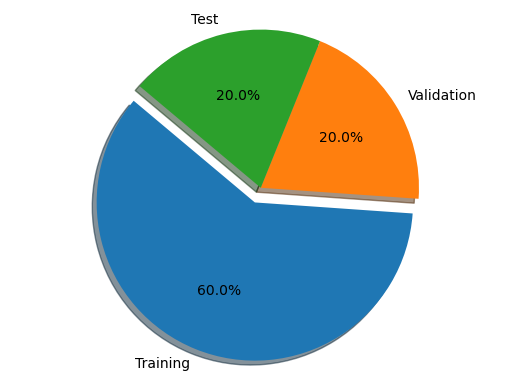

A continuación se muestra una vista previa de la separación de los datos del tercer modelo:

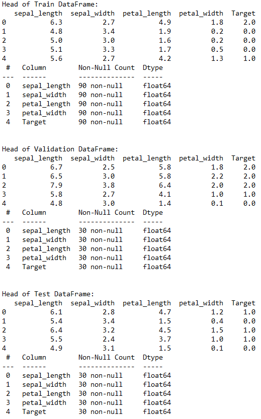

NOTA: Esta division de datos es valida para el tercer modelo implementado en este trabajo.

## Modelos de Árbol de Decisión
En esta seccion se realiza la implementacion de tres modelos de árbol de decisión. La diferencia entre los primeros dos es el criterio de ganancia de información del algoritmo. Esto con la intencion de hacer notar alguna diferencia entre criterios y diferenciar el desempeño entre modelos.

### Primer Modelo (Criterio GINI)
El primer modelo se entrena utilizando el criterio GINI para la ganancia de información. A continuación, se muestran los resultados de este modelo:

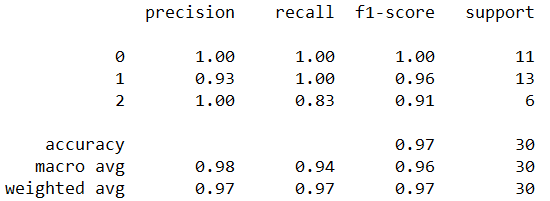

Se puede pareciar que para este primer modelo utilizando el criterio de ganancia de información de GINI, obtenemos un buen modelo de acuerdo a las metricas. Podemos confirmar lo anterior visualizando la matriz de confusion:

Ahora, con la intención de mejorar el desempeño del modelo, se cambia el criterio de ganancia de información a entropía.

### Segundo Modelo (Criterio Entropía)
El segundo modelo se entrena utilizando el criterio de entropía para la ganancia de información. A continuación, se muestran los resultados de este modelo:

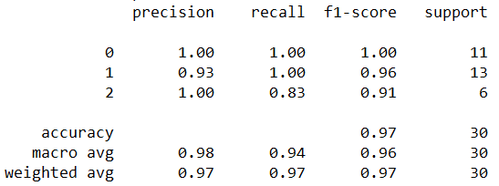

Se observa que al cambiar el criterio de ganancia de información, no se ve afectado el desempeño del modelo. Podemos confirmar lo anterior con la matriz de confusion del modelo:

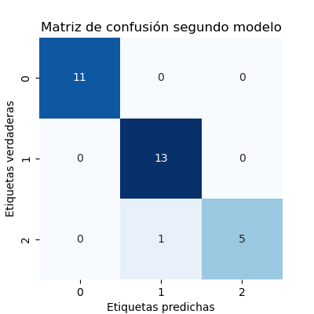

De lo anterior, podemos concluir que en la práctica, la impureza de Gini y la entropía suelen dar resultados similares, y la elección entre ellas puede **no afectar drásticamente** al rendimiento general del modelo. Sin embargo, conocer sus diferencias permite tomar decisiones más informadas a la hora de diseñar, ajustar e interpretar modelos de árboles de decisión. 

Por ejemplo, si estamos trabajando con un conjunto de datos en el que los desequilibrios de clase son comunes, la impureza Gini podría ser una mejor opción, ya que tiende a ser menos sensible a la distribución de clases. En este caso, tenemos clases balanceadas y por esto es posible notar diferencias mínimas

Por lo anterior, se realiza un tercer modelo con los parametros default, ya que estos suelen ajustarse automáticamente y así dar los mejores resultados posibles.

### Tercer Modelo (Mejores Parámetros)
El tercer modelo se entrena con los mejores parámetros seleccionados. A continuación, se presentan los resultados del conjunto de prueba y validación y se visualiza el árbol de decisión:

1. Conjunto de Prueba

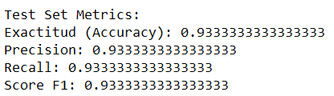

2. Conjunto de Validación

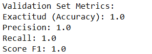

De los resultados anteriores podemos notar que el modelo de árbol de decisión parece funcionar muy bien tanto en el conjunto de prueba como en el de validación. Sin embargo, es esencial tener en cuenta la posibilidad de sobreajuste cuando el modelo funciona perfectamente en el conjunto de validación. Por lo anterior, es relevante supervisar el rendimiento del modelo en datos no vistos en escenarios del mundo real para asegurarse de que generaliza bien. 

Para esto, agregaremos al modelo datos que no ha visto antes para evaluar su desempeño y así darnos una mejor idea de la generalización del modelo

#### Predicciones con nuevos datos

Se han utilizado los siguientes datos y se obtuvieron los siguientes resultados:

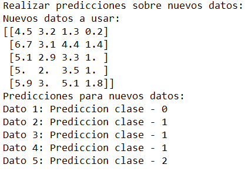

Dado que son datos generados aleatoriamente, no tenemos las etiquetas reales para poder evaluar el modelo con datos nunca antes vistos. La evaluación de un modelo con datos nunca antes vistos suele consistir en comparar las predicciones del modelo sobre los datos nuevos con las etiquetas reales. Sin embargo, podemos darnos una idea del desempeño de clasificación mediante la importancia de las variables y el propio arbol de decision:

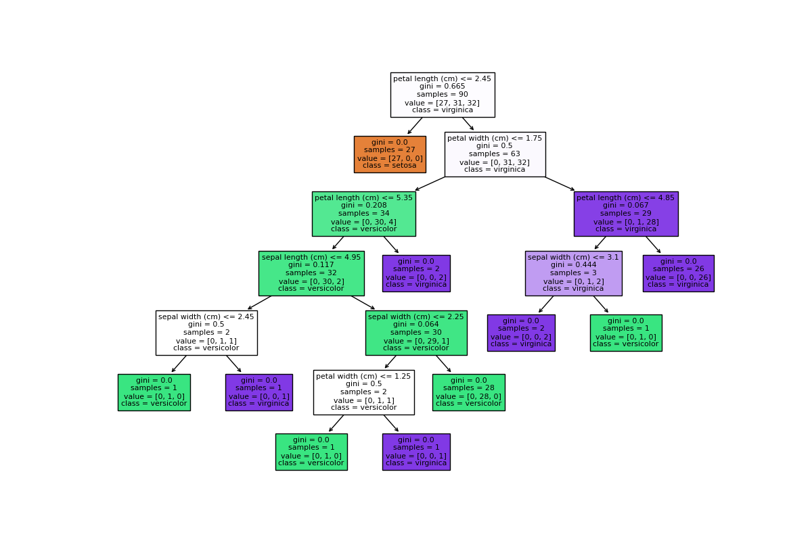

Como observación, este árbol puede ser "podado". Referirse a la sección de [Mejoras en el Desempeño](#mejoras-en-el-desempeño)

#### Análisis de Sesgo, Varianza y Ajuste del Modelo
El diagnóstico de sesgo, varianza y ajuste del modelo se realiza en el tercer modelo con los mejores parámetros con el objetivo de determinar si existen sesgos, varianzas y engeneral, el ajuste del modelo. Para realizar este análisis, se utilizó una función definida por el usuario que toma en cuenta lo siguiente:

- El  **bias_diagnosis** (diagnóstico de sesgo) se determina comparando la precisión de entrenamiento y la precisión de validación. Si la precisión del entrenamiento es mayor, sugiere un sesgo bajo (ajuste); de lo contrario, sugiere un sesgo alto (ajuste insuficiente (_underfitting_)).

- El **variance_diagnosis** (diagnóstico de varianza) se determina comparando la puntuación F1 de entrenamiento y la puntuación F1 de validación. Si la puntuación F1 de entrenamiento es más alta, sugiere una varianza baja; de lo contrario, sugiere una varianza media (sobreajuste).

- El diagnóstico **model_fit** (ajuste de modelo) se basa en los diagnósticos de sesgo y varianza. Si cumple los criterios de un buen ajuste (bajo sesgo y baja varianza), se etiqueta como "Buen ajuste (ajuste razonable)"; en caso contrario, se etiqueta como "Sobreajuste".

Se puede apreciar con mayor detalle el funcionamiento y estructura de función _diagnose_model_performance()_ en el código del modelo: https://github.com/juancarloscorona14/mod2-frame/blob/main/decision_tree_framework.py

Los resultados obtenidos de la funcion implementada en el codigo son los siguientes:

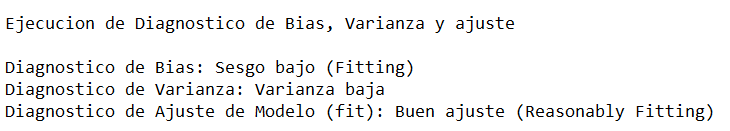

En conjunto, estas observaciones implican que el modelo ha logrado un buen equilibrio entre sesgo y varianza. Se ajusta bien a los datos de entrenamiento sin sobreajustarse (bajo sesgo y baja varianza), lo cual es un resultado deseable en el aprendizaje automático.

A continuación se muestra la comparación entre el conjunto de prueba y conjunto de validación para comprobar lo anterior:

De la visualización anterior, podemos notar que para este modelo, los valores del conjunto de prueba y validación corresponden, por lo que se puede decir que tienen una varianza baja y un sesgo bajo.

Para visualizar el balance entre las tres características, se realiza la siguiente gráfica:

- Sesgo (sesgo bajo - ajuste): 

    El gráfico de radar muestra que el diagnóstico de sesgo está en la categoría "Sesgo bajo (ajuste)". Esto sugiere que el modelo no presenta un alto nivel de desajuste; es capaz de capturar los patrones subyacentes en los datos razonablemente bien.

- Varianza (Varianza baja): 

    El gráfico de radar indica que el diagnóstico de varianza se encuentra en la categoría "Varianza baja". Esto implica que el modelo no muestra un alto nivel de sobreajuste; generaliza bien a los datos de validación o prueba sin excesiva sensibilidad al ruido en los datos de entrenamiento.

- Ajuste del modelo (Buen ajuste - Ajuste razonable): 
    
    El gráfico de radar muestra que el diagnóstico de ajuste del modelo se sitúa en la categoría "Buen ajuste (ajuste razonable)". Esto significa que el modelo funciona bien tanto en los conjuntos de entrenamiento como en los de validación/prueba, capturando los patrones esenciales de los datos sin complicar excesivamente el modelo.

## Mejoras en el Desempeño
Se aplicaron tres técnicas para mejorar el desempeño del modelo:

- Criterios Ganancia Información:

    La primera técnica que se implementó para tratar de mejorar el modelo fue el cambio de criterio de ganancia de información. Como bien se comentó anteriormente la justificación para realizar este cambio fue que se quería ver si existía alguna diferencia. Sin embargo, por la naturaleza de los datos y del modelo per se, no se observan diferencias significativas, por lo que esta estrategía no fue la más efectiva para poder mejorar el desempeño. El antes y el después de la técnica se puede apreciar en el apartado correspondiente.

- Hyperparameter Tuning

    Esta técnica tiene como objetivo buscar el mejor conjunto de parámetros posibles para el modelo. 

    Utilizamos GridSearchCV para realizar la búsqueda en la cuadrícula con una validación cruzada de 5 veces (cv=5) y una puntuación basada en la precisión.

    Después de ajustar la búsqueda de cuadrícula a los datos de entrenamiento, imprimimos los mejores hiperparámetros encontrados y el mejor clasificador.

    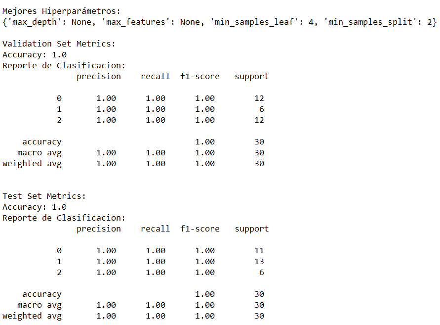

    Podemos obervar que la busqueda de parámetros óptimos ha resultado en una clasificación perfecta. Lo anterior no significa que este método sea el mejor para optimizar ya que depende del modelo y de los datos utilizados. GridSearch es una buena alternativa para otro tipo de modelos.

- Pruning

    La poda es una técnica utilizada para evitar que los árboles de decisión se ajusten en exceso (overfitting) reduciendo su tamaño y complejidad. Los árboles de decisión pueden volverse demasiado complejos con facilidad, captando el ruido de los datos y dando lugar a una generalización deficiente. El objetivo de la poda es simplificar el árbol eliminando las ramas que no mejoran significativamente la precisión de la predicción.

    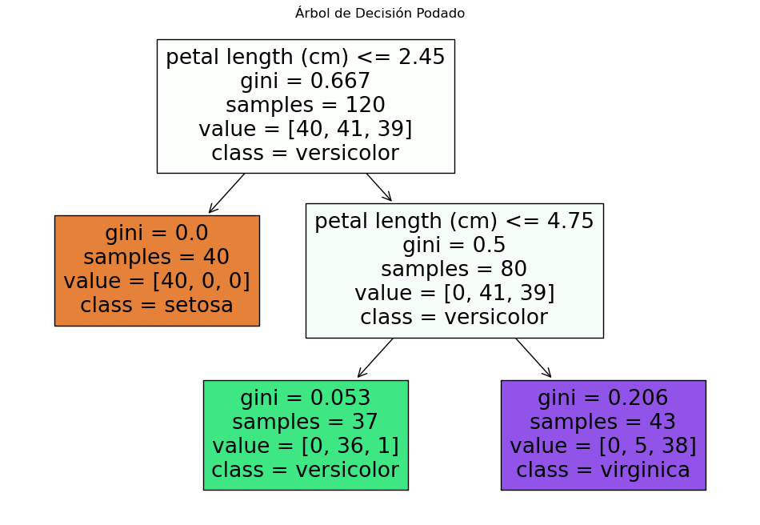

    Así es como luce el mismo árbol de decisión podado. Podemos notar que este se redujo a 2 niveles de profundidad. De esta forma se evitará un sobre ajuste y una mejor generalización para la clasificación de datos nuevos.

    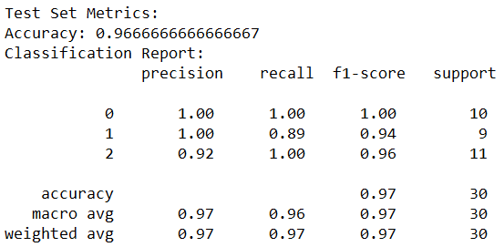

    Se puede ajustar el valor ccp_alpha para controlar el nivel de poda. Los valores más altos darán como resultado un árbol más simple y más podado, mientras que los valores más bajos darán como resultado un árbol más complejo. Encontrar el valor óptimo de ccp_alpha depende de su conjunto de datos específico y del equilibrio entre la complejidad del modelo y la precisión.

## Conclusiones
En este informe, se ha analizado en detalle la implementación y evaluación de un modelo de Árbol de Decisión en el conjunto de datos "Iris". Se han explorado conceptos clave como sesgo, varianza y ajuste del modelo. Además, se han aplicado técnicas de mejora de desempeño para optimizar el modelo. El conjunto de datos "Iris" resultó ser apropiado para el algoritmo de Árbol de Decisión, demostrando su capacidad de generalización. El diagnóstico de sesgo y varianza reveló que el modelo tiene un buen ajuste y una varianza baja. La mayoría de las técnicas de mejora proporcionaron resultados positivos en el desempeño del modelo.

